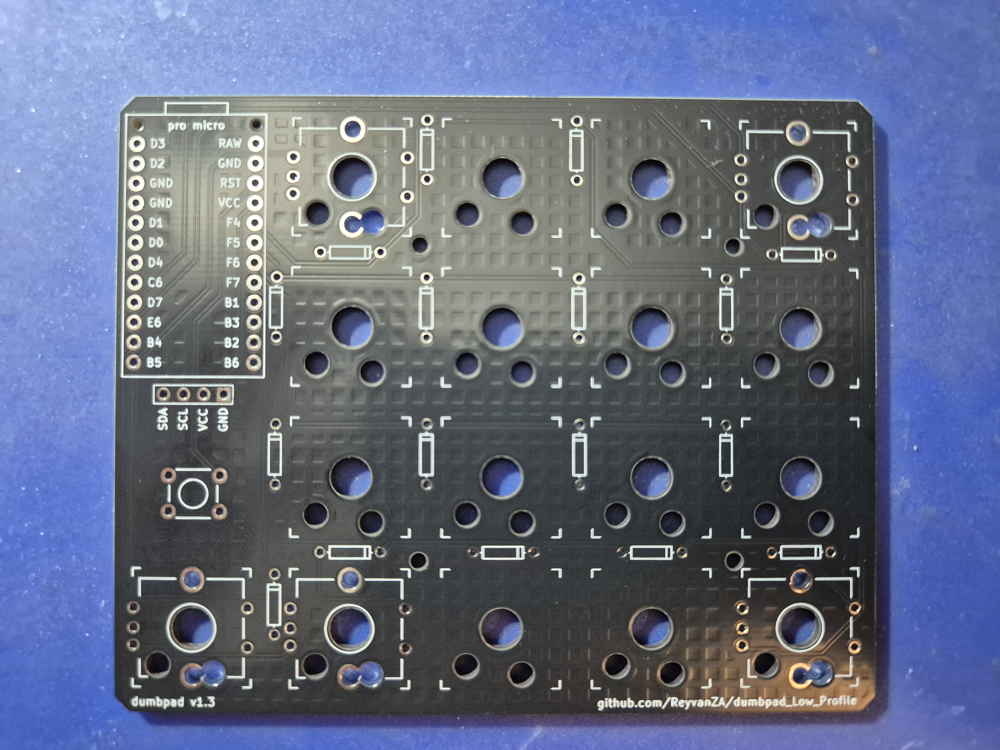
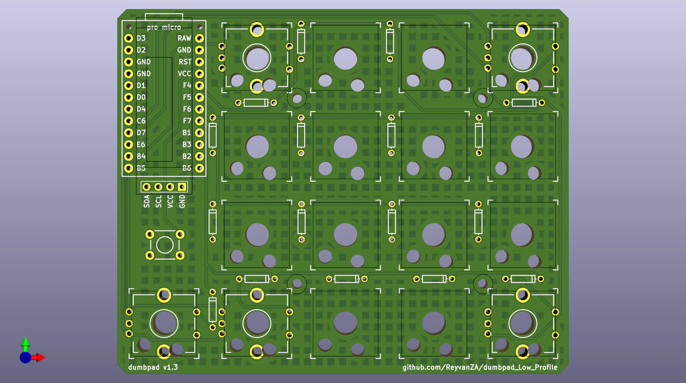
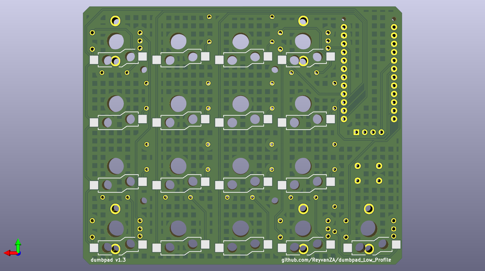

# dumbpad - Low Profile OLED (aka v1.3)

Designed by [ReyvanZA]

## Description

Version of the original dumbpad but with support for an OLED display by Keebd, now with gateron low profile hot swap sockets.
There are also mounting points for a uController cover, and through holes for wires if using a ProMicro nrf52840 for the battery wires (admittedly not overly practical).

Only 1.3.1 has been tested with the gateron low profile hot-swap sockets, but the design files for 1.3 and 1.3.2 are included for reference. Keycap clearance has not been tested yet.

### Revisions

- 1.2 Keebd OLED with resistors
- 1.3.1 Gateron low profile hot-swap sockets (Confirmed working - need low profile keys to test)
- 1.3.2 Combined plated though holes for EC11 rotary encoder mounting points and socket, added mounting holes for uController cover.

### References

- Gateron low profile hot-swap sockets: https://gist.github.com/niw/22c68c2d7c869b990588b4875a654442

### Challenges/Todo

- Check keycap clearance

#### dumbpad v1.3.1

#### Renders (Latest Revision)

### Bill of materials
- 1 x PCB
- 16 x Gateron low profile switches (Link)
- 16 x Gateron low profile hot-swap sockets (Link)
- X x Keycaps (compatible with Gateron low profile switches)
- 17 x 1n4148 diodes (thru hole)
- 1 x Arduino Pro Micro or pin-compatible ATmega32u4-based MCU (Or teensy for the teensy version)
- 1 x or 2x EC11 rotary encoder with pushbutton (7-pin)
- 1 x 6mm tactile switch (to reset MCU)
- 1 x 0.91" 128X32 OLED Display (Optional)

## OLED Firmware

The OLED firmware is different and can be found here [Firmware](https://docs.keebd.com/firmware/)

## How to build 
- Be very careful when soldering pads next to rotary encoder through holes (encoder pin b), you may get bridging.
- I've moved the pin slightly closer to the ground pin to aleviate this issue. This does not affect assembly.

You can follow the instructions from the main [readme](https://github.com/imchipwood/dumbpad#getting-started) or follow the instruction in this [blog](https://www.timowielink.com/post/how-to-build-a-macropad) from [Timo Wielink](https://github.com/TimoWielink)

When the 1.3.1 production file is created by your PCB manufacturer, you may have a query on the overlapping through holes. If given the option allow them to plate both holes.

